# TP1DPBO2025C2
Saya Zaki Adam dengan NIM 2304934 mengerjakan Latihan 1 dalam mata kuliah Desain dan Pemrograman Berorientasi Objek untuk keberkahan-Nya maka saya tidak melakukan kecurangan seperti yang telah dispesifikasikan. Aamiin.

## Desain Program
Program terdiri dari 1 class yaitu Petshop
Di dalam class Petshop memiliki 4 atribut, yaitu:
* ID
* Nama Produk
* Kategori Produk
* Harga Produk

khusus untuk bahasa PHP ada atribut tambahan, yaitu:
* Gambar Produk

## Alur Program
- Untuk menjalankan program, jalankan sesuai bahasa pemrograman yang ingin dieksekusi.
- Akan muncul tampilan menu:
    - `1` **ADD** → Menambahkan data  
    - `2` **SHOW** → Menampilkan seluruh data  
    - `3` **UPDATE** → Mengubah data yang dipilih sesuai ID-nya  
    - `4` **DELETE** → Menghapus data yang dipilih sesuai ID-nya  
    - `5` **FIND** → Mencari data yang dipilih sesuai namanya  
    * `6` **EXIT** -> Keluar dari program

## Dokumentasi C++
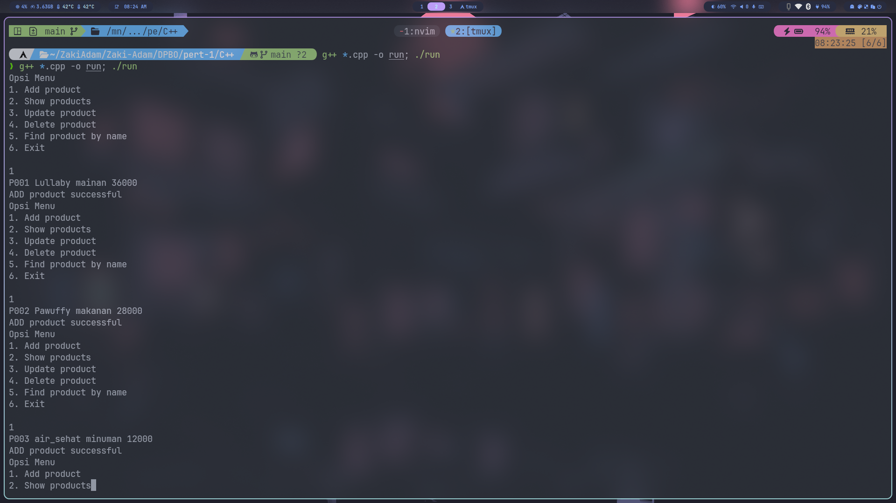
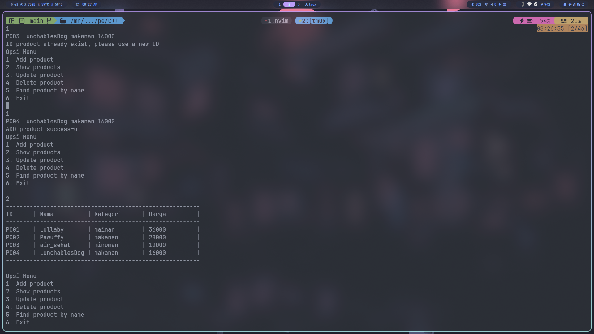
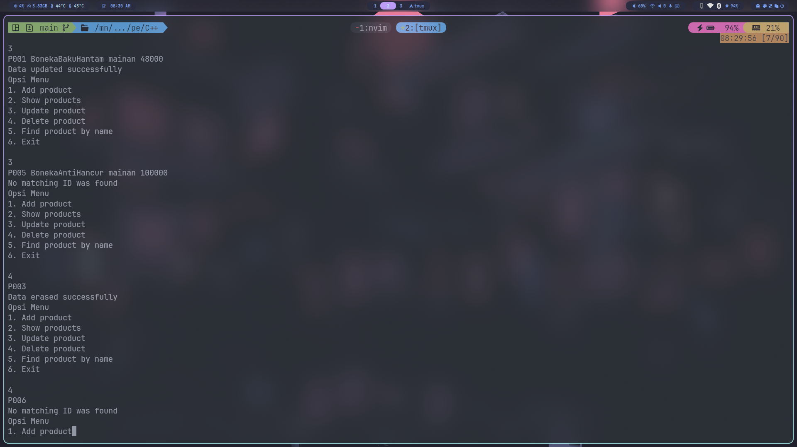
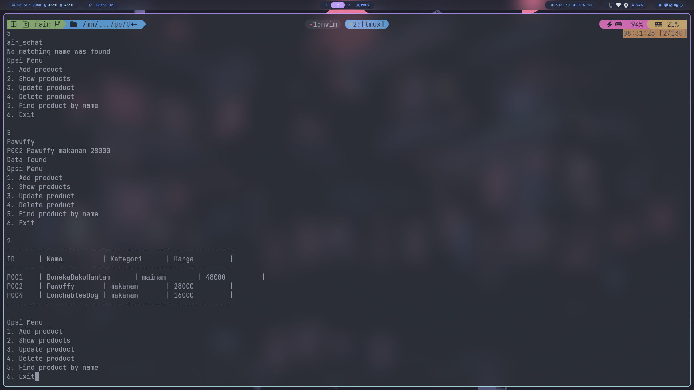

## Dokumentasi Python

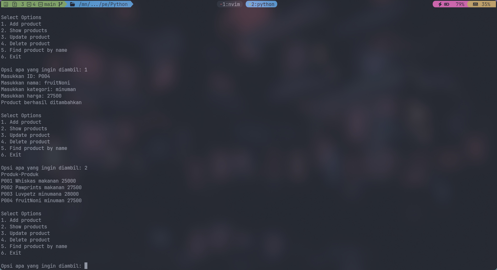
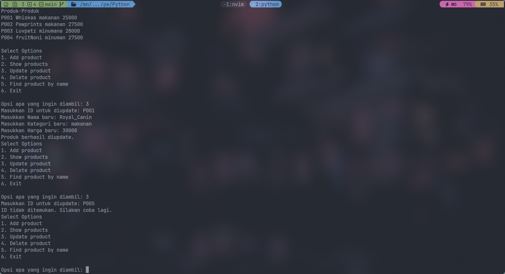
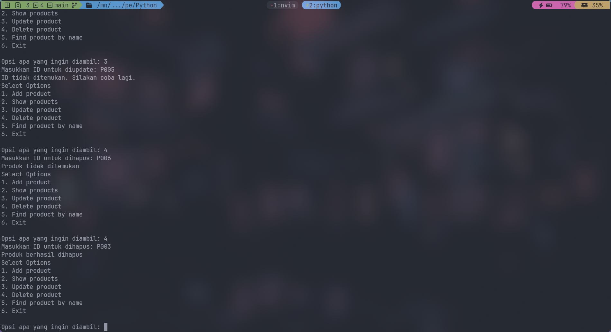
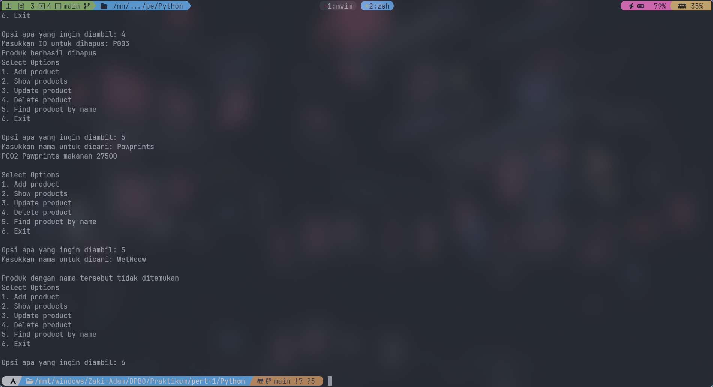

## Dokumentasi Java
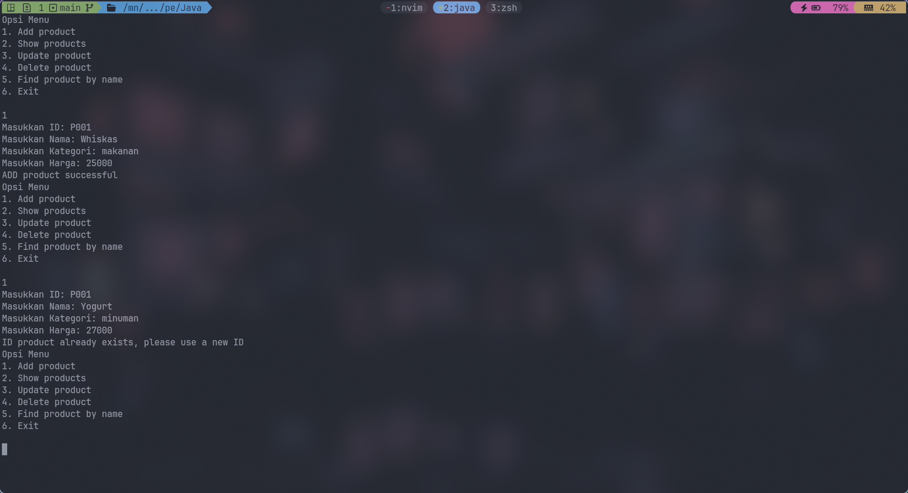
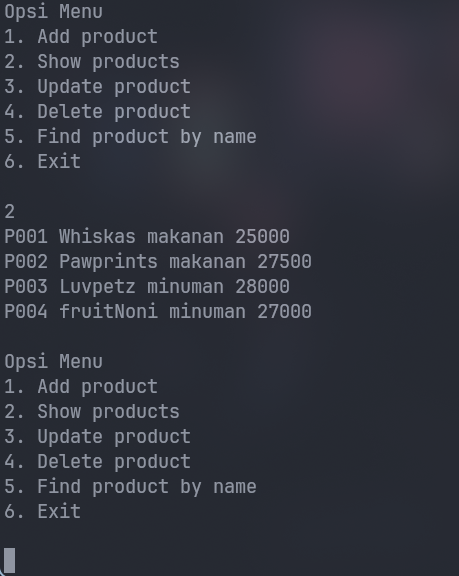
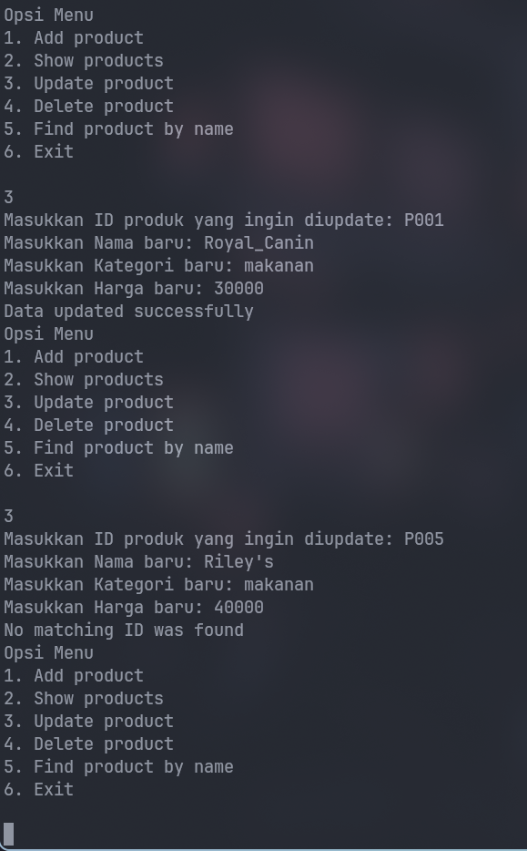
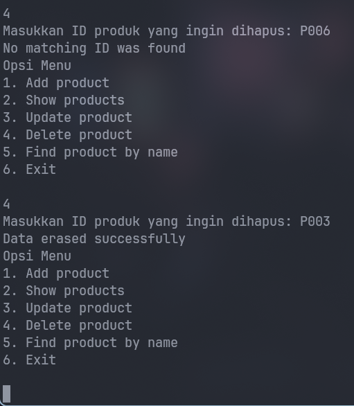
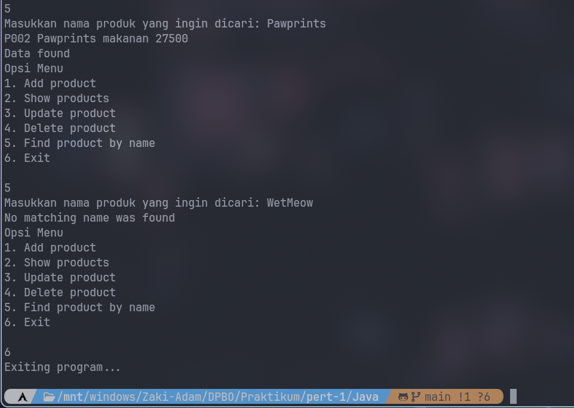

## Dokumentasi PHP
[Demo Video](https://github.com/re4dam/TP1DPBO2025C2/blob/main/php/video/proof.mkv)
